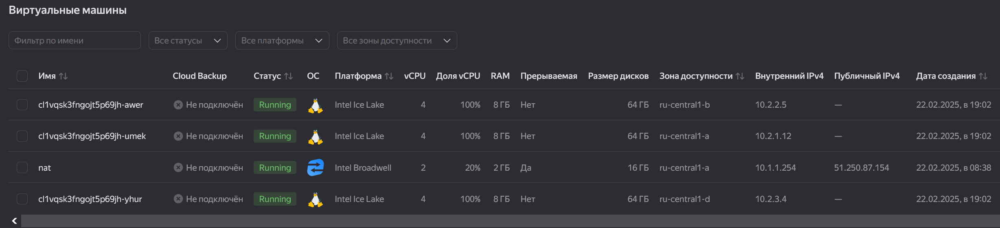
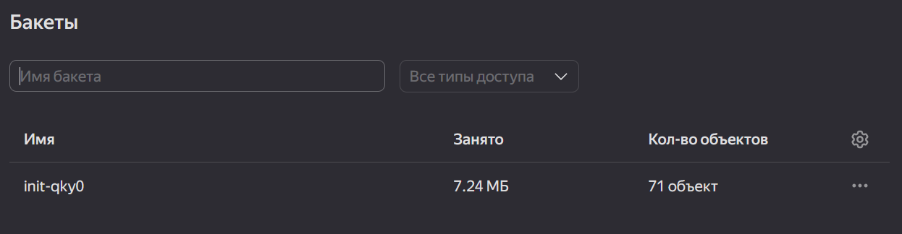
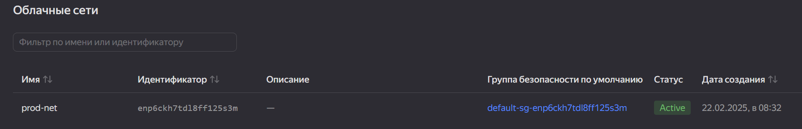
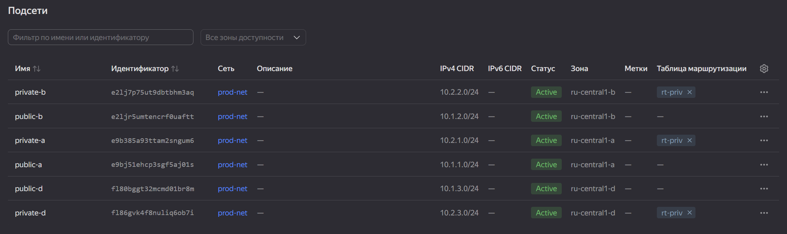
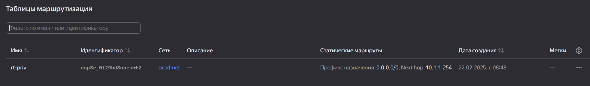
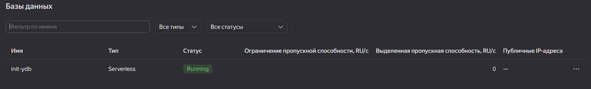
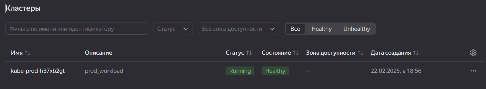
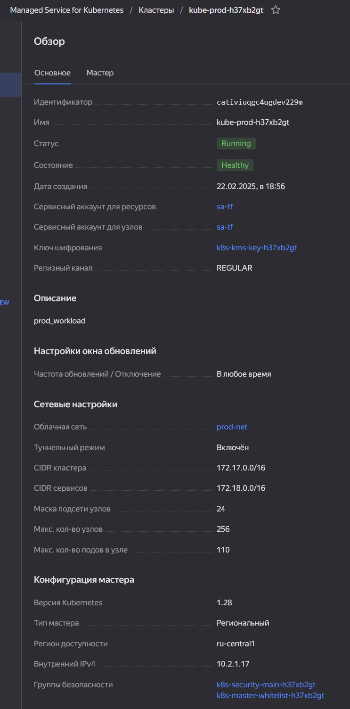

# Дипломный практикум в Yandex.Cloud - Илларионов Дмитрий

  * [Цели:](#цели)
  * [Этапы выполнения:](#этапы-выполнения)
     * [Создание облачной инфраструктуры](#создание-облачной-инфраструктуры)
     * [Создание Kubernetes кластера](#создание-kubernetes-кластера)
     * [Создание тестового приложения](#создание-тестового-приложения)
     * [Подготовка cистемы мониторинга и деплой приложения](#подготовка-cистемы-мониторинга-и-деплой-приложения)
     * [Установка и настройка CI/CD](#установка-и-настройка-cicd)
  * [Что необходимо для сдачи задания?](#что-необходимо-для-сдачи-задания)
  * [Как правильно задавать вопросы дипломному руководителю?](#как-правильно-задавать-вопросы-дипломному-руководителю)

**Перед началом работы над дипломным заданием изучите [Инструкция по экономии облачных ресурсов](https://github.com/netology-code/devops-materials/blob/master/cloudwork.MD).**

---
## Цели:

1. Подготовить облачную инфраструктуру на базе облачного провайдера Яндекс.Облако.
2. Запустить и сконфигурировать Kubernetes кластер.
3. Установить и настроить систему мониторинга.
4. Настроить и автоматизировать сборку тестового приложения с использованием Docker-контейнеров.
5. Настроить CI для автоматической сборки и тестирования.
6. Настроить CD для автоматического развёртывания приложения.

---
## Этапы выполнения:

---

### Доформулирую требования

- Получить отказоустойчивую работу сайта компании в яндекс облаке (в кубернетис кластере).
- Создать инфраструктуру в яндекс облаке, через подходы DevOps - обеспечить автоматическое управление инфраструктурой через IaC (при изменении кода, должна автоматически меняться инфраструктура).
- У компании есть группа разработчиков, которые, на своих ПК разрабатывают сайт компании. Разработчики "на выходе" выдают статичные файлы html для веб сайта.
- Спроектировать и реализовать решение: выбрать Web-сервер и развернуть его в облаке в отказоустойчивом кластере, настроить работу Web-сервера с файлами html, полученными от разработчиков - обеспечить рабту сайта компании. 
- Развертывание инфраструктуры и управление должны быть через ПО Terraform. При этом terraform-state-backend файл должен находится в облаке в S3 хранилище + обеспечивать работу блокировки tfstate-backend.

### Общее описание решения


Использую два облака:


В первом создал облачный сервис gitlab для выполнения автоматизации и ВМ - раннер для gitlab. 
Эти ресурсы использую дял автоматизации - последний этап задания.

Второе облако "init" - тут prod-среда - сайт компании в кластере и вся инфраструктура, которую развертываию через автоматизацию.

Итоговый IaC код в сервисе gitlab в репозиториях:

- https://gitla.gitlab.yandexcloud.net/d-site/infra - тут IaC инфраструктуры.
- https://gitla.gitlab.yandexcloud.net/d-site/site - тут IaC сайта.

Но, что бы не тратить ресурсы в яндекс облаке, пока этот gilab пока остановил.
Готов включить если нжуно будет для демонстрации и проверки.

Для ознакомления с кодом - код перенес еще и в бесплатный gitlab.com в два репозитория:

https://gitlab.com/d-site/infra
https://gitlab.com/d-site/site  


Результаты работы автоматизации можно смотреть тут соотвественно:
Если включен gitlab в яндекс облаке:
- https://gitla.gitlab.yandexcloud.net/d-site/infra/-/jobs - для создания инфраструктуры (и управления).
- https://gitla.gitlab.yandexcloud.net/d-site/site/-/jobs - для сборки и деплоя приложения - сайта

Так же можно посмотреть результаты выполнения кода на публичном gitlab.com:

https://gitlab.com/d-site/infra/-/jobs
https://gitlab.com/d-site/site/-/jobs 

Код IaC терраформа, который в этом репозитории в папке `terraform` - использовался на этапах до создания автоматизации - оставил для истории.
После того как создал автоматизацию код далее переместил и развивал уже в репозиториях gitlab сервиса в яндекс облаке.
Поэтому окончательнй код см. в репозиториях gitlab (ссылки даны выше).
---

### Создание облачной инфраструктуры

Для начала необходимо подготовить облачную инфраструктуру в ЯО при помощи [Terraform](https://www.terraform.io/).

Особенности выполнения:

- Бюджет купона ограничен, что следует иметь в виду при проектировании инфраструктуры и использовании ресурсов;
Для облачного k8s используйте региональный мастер(неотказоустойчивый). Для self-hosted k8s минимизируйте ресурсы ВМ и долю ЦПУ.
В обоих вариантах используйте прерываемые ВМ для worker nodes.

Предварительная подготовка к установке и запуску Kubernetes кластера.

1. Создайте сервисный аккаунт, который будет в дальнейшем использоваться Terraform для работы с инфраструктурой с необходимыми и достаточными правами. 
Не стоит использовать права суперпользователя

2. Подготовьте [backend](https://www.terraform.io/docs/language/settings/backends/index.html) для Terraform:  
   а. Рекомендуемый вариант: S3 bucket в созданном ЯО аккаунте(создание бакета через TF)
   б. Альтернативный вариант:  [Terraform Cloud](https://app.terraform.io/)
3. Создайте конфигурацию Terrafrom, используя созданный бакет ранее как бекенд для хранения стейт файла. 
Конфигурации Terraform для создания сервисного аккаунта и бакета и основной инфраструктуры следует сохранить в разных папках.
4. Создайте VPC с подсетями в разных зонах доступности.
5. Убедитесь, что теперь вы можете выполнить команды `terraform destroy` и `terraform apply` без дополнительных ручных действий.
6. В случае использования [Terraform Cloud](https://app.terraform.io/) в качестве [backend](https://www.terraform.io/docs/language/settings/backends/index.html) убедитесь, 
что применение изменений успешно проходит, используя web-интерфейс Terraform cloud.

Ожидаемые результаты:

1. Terraform сконфигурирован и создание инфраструктуры посредством Terraform возможно без дополнительных ручных действий, стейт основной конфигурации сохраняется 
в бакете или Terraform Cloud
2. Полученная конфигурация инфраструктуры является предварительной, поэтому в ходе дальнейшего выполнения задания возможны изменения.

---

#### Решение по созданию облачной инфраструктуры

1. Создал через терраформ (с рабочего ПК) отдельное облако "init" для инфраструктуры и создал сервисный аккаунт. Код создания облака в `terraform\1_init\` в файлах `main.tf` и `init.tf` . 
2. Создал S3 хранилище и ydb и таблицу для обеспечения блокировки state файла и пернес туда state-файл терраформа. Код в `terraform\1_init\tf-state.tf` При этом сгенерил файл `terraform\1_init\backend.tf` который обеспечиват рабоботу с терраформ-state-bakend в S3. Перевел хранение стейт-файла терраформа в s3.


При этом освоил два разных варианта для помещения state файла в S3 - свой код и код через готовый модуль от яндекса.
Некоторые скрины:


Но, в итоге решил использовать готовый модуль от яндекса - он мне понравился.

3. Создал в отдельном облаке "рабочую ВМ" и настроил на работу с облаком "init" через ранее созданный сервисный аккаунт и с хранением терраформ-бэкенда в S3 (код развертывания ВМ в `terraform\00_ВМ` ).

4. Создал VPC - см. файл `terraform\1_init\vpc.tf` При этом создал общую облачную сеть `prod_net` и создал подсети:

Три публичных подсети в трех зонах доступности:
`public_a`
`public_b`
`public_d`

В публичной подсети в `зоне А` -  созадл ВМ c сервисом NAT - чтобы через нее подключаться из Интернет ко внутренним ВМ в приватных подсетях, и чтобы внутренние ВМ имели бы выход в Интернет. Код создания NAT ВМ см. в файле `terraform\1_init\nat.tf` .

Создал таблицу маршрутизации `yandex_vpc_route_table.rt_priv"` - для перенаправления трафика из приватных ВМ в Интернет. Код в файле `terraform\1_init\vpc.tf`.

Cоздал три подсети приватных - для кластера k8s:
`private_a`
`private_b`
`private_d`

Из Интернет прямого доступа в подсети приватные не будет.
При этом для этих подсетей настроил маршрутизацию трафика исходящего в Интернет (для скачки атефактов и пр.).
Кластер k8s будет в защищенной сети без прямого доступа из Интернет для безопасности.

Необходимые роли для работы сервисного аккаунта задаю в файлах:

`terraform\1_init\sa-roles.tf` 

---
### Создание Kubernetes кластера

На этом этапе необходимо создать [Kubernetes](https://kubernetes.io/ru/docs/concepts/overview/what-is-kubernetes/) кластер 
на базе предварительно созданной инфраструктуры.   Требуется обеспечить доступ к ресурсам из Интернета.

Это можно сделать двумя способами:

1. Рекомендуемый вариант: самостоятельная установка Kubernetes кластера.  
   а. При помощи Terraform подготовить как минимум 3 виртуальных машины Compute Cloud для создания Kubernetes-кластера. 
   Тип виртуальной машины следует выбрать самостоятельно с учётом требовании к производительности и стоимости. 
   Если в дальнейшем поймете, что необходимо сменить тип инстанса, используйте Terraform для внесения изменений.  
   б. Подготовить [ansible](https://www.ansible.com/) конфигурации, можно воспользоваться, 
   например [Kubespray](https://kubernetes.io/docs/setup/production-environment/tools/kubespray/)  
   в. Задеплоить Kubernetes на подготовленные ранее инстансы, в случае нехватки каких-либо ресурсов вы всегда можете создать их при помощи Terraform.
2. Альтернативный вариант: воспользуйтесь сервисом [Yandex Managed Service for Kubernetes](https://cloud.yandex.ru/services/managed-kubernetes)  
  а. С помощью terraform resource для [kubernetes](https://registry.terraform.io/providers/yandex-cloud/yandex/latest/docs/resources/kubernetes_cluster) 
  создать **региональный** мастер kubernetes с размещением нод в разных 3 подсетях      
  б. С помощью terraform resource для [kubernetes node group](https://registry.terraform.io/providers/yandex-cloud/yandex/latest/docs/resources/kubernetes_node_group)
  
Ожидаемый результат:

1. Работоспособный Kubernetes кластер.
2. В файле `~/.kube/config` находятся данные для доступа к кластеру.
3. Команда `kubectl get pods --all-namespaces` отрабатывает без ошибок.

#### Решение по созданию кластера Kubernetis

Роли необходимые для работы сервисного аккаунта для кубернетис задают тут:
`terraform\1_init\sa_roles_k8.tf` 

В файле `terraform\1_init\kms.tf` создаю симметричный ключ шифрования и даю права для сервисного аккаунта.

Cоздаю региональный кластер k8s и группу доступности (региональную) из серверов в трех разных зонах доступности - код в файле `terraform\1_init\prod_k8.tf`.

Получаю конфиг для подключения (на NAT ВМ):

```
yc managed-kubernetes cluster get-credentials --id cativiuqgc4ugdev229m --internal
```

`
root@nat:~# yc managed-kubernetes cluster get-credentials --id cativiuqgc4ugdev229m --internal

Context 'yc-kube-prod-h37xb2gt' was added as default to kubeconfig '/root/.kube/config'.
Check connection to cluster using 'kubectl cluster-info --kubeconfig /root/.kube/config'.

Note, that authentication depends on 'yc' and its config profile 'sa-tf'.
To access clusters using the Kubernetes API, please use Kubernetes Service Account.
`
Конфиг:


Проверяю работу с кластером через kubectl:

```
kubectl cluster-info --kubeconfig /root/.kube/config
```


```
kubectl get nodes
```


В итоге получил созданную инфраструктру:



















---
### Создание тестового приложения

Для перехода к следующему этапу необходимо подготовить тестовое приложение, эмулирующее основное приложение разрабатываемое вашей компанией.

Способ подготовки:

1. Рекомендуемый вариант:  
   а. Создайте отдельный git репозиторий с простым nginx конфигом, который будет отдавать статические данные.  
   б. Подготовьте Dockerfile для создания образа приложения.  
2. Альтернативный вариант:  
   а. Используйте любой другой код, главное, чтобы был самостоятельно создан Dockerfile.

Ожидаемый результат:

1. Git репозиторий с тестовым приложением и Dockerfile.
2. Регистри с собранным docker image. В качестве регистри может быть DockerHub или [Yandex Container Registry](https://cloud.yandex.ru/services/container-registry), 
созданный также с помощью terraform.

#### Решение по созданию тестового приложения

* создал регистри для хранения docker images в яндекс облаке - см. файл `terraform\1_init\registry.tf` 

* но в итоге все же использовал для простоты hub.docker.com для хранения там своих образов.

* Создал репозиторий `https://github.com/DmitryIll/test-app.git` и в него поместил статичные файлы сайта и файл docker compose.
* после создания автоматизации - итоговый код см. в репозиториях gitlab (ссылки даны были выше).
* тестирую приложение пока в докер контейнере:
```
docker build -t site:1.0 .
docker run -p 80:80 site:1.0
```
Сайт работает:


Пробую пока вручную загрузить образ в регистри:

Один из вариантов:

```
echo $IAM_TOKEN | docker login   --username iam   --password-stdin   cr.yandex
```

Другой вариант:

```
yc container registry configure-docker
```

Пушу образ в регистри:

```
docker tag site:1.0 cr.yandex/crp89b913h17litceuqc/site:1.0
docker push cr.yandex/crp89b913h17litceuqc/site:1.0
```


Удаляю локально все docker images с ВМ:

```
docker image rm 29cda006b448 --force
```


Пробую загрузить из регистри - проверяю:
Образ появился:


Т.е. регистри работает ок.

---
### Подготовка cистемы мониторинга и деплой приложения

Уже должны быть готовы конфигурации для автоматического создания облачной инфраструктуры и поднятия Kubernetes кластера.  
Теперь необходимо подготовить конфигурационные файлы для настройки нашего Kubernetes кластера.

Цель:
1. Задеплоить в кластер 
[prometheus](https://prometheus.io/), [grafana](https://grafana.com/), 
[alertmanager](https://github.com/prometheus/alertmanager),
[экспортер](https://github.com/prometheus/node_exporter) основных метрик Kubernetes.
2. Задеплоить тестовое приложение, например, [nginx](https://www.nginx.com/) сервер отдающий статическую страницу.

Способ выполнения:
1. Воспользоваться пакетом [kube-prometheus](https://github.com/prometheus-operator/kube-prometheus),
который уже включает в себя [Kubernetes оператор](https://operatorhub.io/) для [grafana](https://grafana.com/), 
[prometheus](https://prometheus.io/), [alertmanager](https://github.com/prometheus/alertmanager) 
и [node_exporter](https://github.com/prometheus/node_exporter). 
Альтернативный вариант - использовать набор helm чартов от [bitnami](https://github.com/bitnami/charts/tree/main/bitnami).

2. Если на первом этапе вы не воспользовались [Terraform Cloud](https://app.terraform.io/), 
то задеплойте и настройте в кластере [atlantis](https://www.runatlantis.io/) для отслеживания изменений инфраструктуры. 
Альтернативный вариант 3 задания: вместо Terraform Cloud или atlantis настройте на автоматический запуск 
и применение конфигурации terraform из вашего git-репозитория в выбранной вами CI-CD системе при любом комите в main ветку. 
Предоставьте скриншоты работы пайплайна из CI/CD системы.

Ожидаемый результат:
1. Git репозиторий с конфигурационными файлами для настройки Kubernetes.
2. Http доступ на 80 порту к web интерфейсу grafana.
3. Дашборды в grafana отображающие состояние Kubernetes кластера.
4. Http доступ на 80 порту к тестовому приложению.

#### Решение по подготовке cистемы мониторинга и деплой приложения

Согласно документации: https://yandex.cloud/ru/docs/managed-kubernetes/operations/create-load-balancer#simple-app

Подготовил файл для деплоя приложения в кубернетис:

`https://github.com/DmitryIll/test-app/blob/main/kuber/site.yaml`

Проверил, сайт открывается по внешнему IP (черз балансировщик пробрасываются запросы в кластер кубер):


Для деплоя системы мониторинга использую helm-chart и провайдер для терраформа для управления helm.
Добавил файл: 
`terraform\1_init\helm.tf`
И добавил файл со значениями параметров: `terraform\1_init\values\chart-monitoring.yaml`

Применил через терраформ.

В кластере проверяю:


Смотрю IP:

```
kubectl get ingress -n kube-monitoring
```

```
NAME                            CLASS   HOSTS         ADDRESS         PORTS   AGE
kube-monitoring-stack-grafana   nginx   mon.dmil.ru   84.201.149.40   80      99m
```

Создаю DNS запись mon.dmil.ru для 84.201.149.40 на отдельном имеющимся у меея хостинге.

Можно смотреть мониторинг кластера:

пароль "adminadmin" 
https://mon.dmil.ru 


---
### Установка и настройка CI/CD

Осталось настроить ci/cd систему для автоматической сборки docker image и деплоя приложения при изменении кода.

Цель:

1. Автоматическая сборка docker образа при коммите в репозиторий с тестовым приложением.
2. Автоматический деплой нового docker образа.

Можно использовать [teamcity](https://www.jetbrains.com/ru-ru/teamcity/), 
[jenkins](https://www.jenkins.io/), [GitLab CI](https://about.gitlab.com/stages-devops-lifecycle/continuous-integration/) или GitHub Actions.

Ожидаемый результат:

1. Интерфейс ci/cd сервиса доступен по http.
2. При любом коммите в репозиторие с тестовым приложением происходит сборка и отправка в регистр Docker образа.
3. При создании тега (например, v1.0.0) происходит сборка и отправка с соответствующим label в регистри, а также деплой соответствующего Docker образа в кластер Kubernetes.

#### Решение по установке и настройке CI/CD

Пробовал использовать gitlab.com со своим раннером (т.к. иначе требуется авторизоваться по номеру телефону не российскому), но, gitlab.com работает очень медленно, поэтому использовал в итоге gitlab - сервис в яндекс облаке (создал).


## Что необходимо для сдачи задания?

1. Репозиторий с конфигурационными файлами Terraform и готовность продемонстрировать создание всех ресурсов с нуля.

Создание инфраструктуры: 
https://gitla.gitlab.yandexcloud.net/d-site/infra

Примеры отработки заданий автоматизации:

Подготовка плана: https://gitla.gitlab.yandexcloud.net/d-site/infra/-/jobs/284
Применение плана: https://gitla.gitlab.yandexcloud.net/d-site/infra/-/jobs/285 

Ранее выполнял destroy: https://gitla.gitlab.yandexcloud.net/d-site/infra/-/jobs/281 

2. Пример pull request с комментариями созданными atlantis'ом или снимки экрана из Terraform Cloud или вашего CI-CD-terraform pipeline.

Создание инфраструктуры:


и :


Сборка образа:


Деплой новой версии:


3. Репозиторий с конфигурацией ansible, если был выбран способ создания Kubernetes кластера при помощи ansible.
- ansible не использовал, использовал облачный кубер.
4. Репозиторий с Dockerfile тестового приложения и ссылка на собранный docker image.

https://gitla.gitlab.yandexcloud.net/d-site/site

Образы приложения в регистри:
https://hub.docker.com/repository/docker/dmil25/site 

5. Репозиторий с конфигурацией Kubernetes кластера.

там же где и сайт в отдельной папке:

https://gitla.gitlab.yandexcloud.net/d-site/site/-/tree/main/kuber?ref_type=heads

6. Ссылка на тестовое приложение и веб интерфейс Grafana с данными доступа.

логин: admin
пароль: adminadmin

Два варианта:
c http:
http://mon.dmil.ru/

c https но с самоподписными сертификатами:

https://mon.dmil.ru/

Пример дашборда:

http://mon.dmil.ru/d/09ec8aa1e996d6ffcd6817bbaff4db1b/kubernetes-api-server?orgId=1&refresh=10s


сам сайт:

http://site.dmil.ru/


7. Все репозитории рекомендуется хранить на одном ресурсе (github, gitlab)


